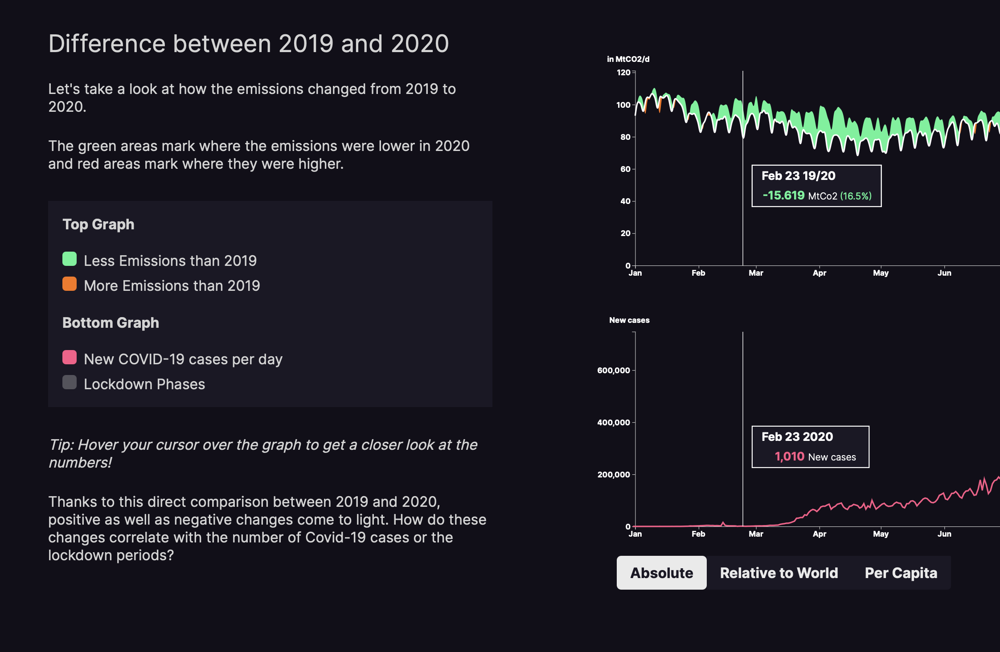

# Rettet die Pandemie unser Klima?

### InfoVis Gruppe 13

Lockdowns, Reiseverbote und eine heruntergefahrene Wirtschaft - 2020 war auf Grund der COVID19 Pandemie nicht nur für die Menschen ein einzigartiges Jahr, sondern auch in Hinblick auf deren Hauptverursacher für Co2-Emissionen interessant.
Die Hoffnung besteht, dass die durch diese besondere Lage bedingten Einschränkungen zumindest für die Aussichten auf einen zukünftigen Co2-Ausstieg einen wichtigen Schritt in die richtige Richtung darstellen könnten.
Doch in wie fern hat die Pandemie die Co2 Emissionen 2020 im Verhältnis zu 2019 beeinflusst? Welche Einblicke kann man für die einzelnen Sektoren sammeln, aus denen sich die Emission zusammensetzt?
Und wie welchen Einfluss hätte eine Weiterführung dieser Regulationen auf unser Co2-Budget?

Link to the current project status: https://timcreatedit.github.io/InfoVis-Gruppe-13/ (please don't use internet explorer)

## Milestone 4

### Ziel 1: Fakten Darstellen

#### Must Have Features

- [x] Line Chart: CO2-Emissionen 2019/2020
- [x] Line Chart: COVID-19 Fälle
- [x] Länderauswahl - Dropdown Menü
- [x] Visualisierung der Lockdown Phasen
- [x] Scrollbasierte Änderungen am CO2 Graphen
  - [x] Anzeige der Änderung zum Vorjahr
  - [x] Aufteilung in Sektoren
- [X] Beschreibende und erklärende Texte
- [x] Dynamische Informationen im Erklärungstext je nach Länderwahl

#### Nice to Have Features

- [x] Animierte Änderungen
- [x] Detaillierte Informationen beim Hovern (Hover-Funktion)
- [ ] Wechsel zwischen absoluten und relativen Daten
- [ ] Vergleichsmodus von 2 Ländern
- [ ] Wechsel in Covid Chart zwischen Faktoren 	(Neuinfektionen, Gesamt, R-Wert)

***

### Ziel 2: Einfluss verdeutlichen

#### Must Have Features

- [x] Sektoren visualisier als Stacked-area Chart
- [x] Detaillierte Informationen beim Hover - genauere Zahlenansicht, Prozentanzeige (Hover-Funktion)
- [x] Länderauswähl - Dropdown Menü
- [x] Beschreibende und erklärende Texte

#### Nice to Have Features

- [x] Animationen
- [ ] Anzeige der anteiligen Änderungen je Sektor

***
  
### Ziel 3: Erreichen der Klimaziele

#### Must Have Features

- [x] Line Chart: Überblick über den CO2 Ausstoßes seit 1750 
- [x] Regler für die angezeigten Jahre
- [x] Prognoselinien
  - [x] Es geht so weiter wie 2019
  - [x] Es geht so weiter wie 2020
- [x] Beschreibende und erklärende Texte

#### Nice to Have Features

- [x] Animationen
- [X] Anzeigen des voraussichtlichen Doomsday
- [X] Countdown bis zum Ablauf des CO2 Budgets in beiden Szenarien
- [ ] Hover Interaktion

## Links zu Datensätzen

[Linkliste](./Links.md)
